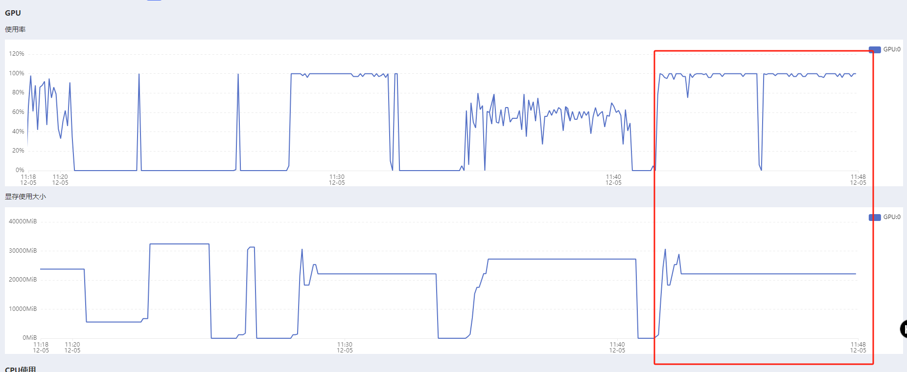

> [【pytorch】profiler tutorials](https://zhuanlan.zhihu.com/p/676165221)


# gpu对比

> 对比 mae的训练 gpu使用率 和 用我们的dataset时的 使用率比较

样本量：10000（我们自己的样本）

## mae

epoch结束时 利用率会突然下降，一个epoch内 训练gpu使用率相对稳定

### bs=2


```python
  5%|▌         | 5020/100000 [04:51<2:55:09,  9.04it/s]{'loss': 12.8217, 'grad_norm': 8.68860912322998, 'learning_rate': 1.8996000000000002e-05, 'step': 5020, 'epoch': 1.0}
  5%|▌         | 5030/100000 [04:51<1:45:57, 14.94it/s]{'loss': 12.5095, 'grad_norm': 8.35328483581543, 'learning_rate': 1.8994e-05, 'step': 5030, 'epoch': 1.01}
  5%|▌         | 5040/100000 [04:52<1:29:10, 17.75it/s]{'loss': 12.5562, 'grad_norm': 12.945196151733398, 'learning_rate': 1.8992e-05, 'step': 5040, 'epoch': 1.01}
  5%|▌         | 5050/100000 [04:52<1:22:34, 19.16it/s]{'loss': 12.4827, 'grad_norm': 11.888640403747559, 'learning_rate': 1.8990000000000003e-05, 'step': 5050, 'epoch': 1.01}
  5%|▌         | 5060/100000 [04:53<1:25:40, 18.47it/s]{'loss': 12.4498, 'grad_norm': 11.74110221862793, 'learning_rate': 1.8988000000000002e-05, 'step': 5060, 'epoch': 1.01}
  5%|▌         | 5071/100000 [04:53<1:25:28, 18.51it/s]{'loss': 12.4181, 'grad_norm': 7.974836826324463, 'learning_rate': 1.8986e-05, 'step': 5070, 'epoch': 1.01}
  5%|▌         | 5080/100000 [04:54<1:36:34, 16.38it/s]{'loss': 12.7911, 'grad_norm': 9.904706954956055, 'learning_rate': 1.8984000000000003e-05, 'step': 5080, 'epoch': 1.02}
  5%|▌         | 5090/100000 [04:55<1:22:29, 19.18it/s]{'loss': 12.4111, 'grad_norm': 8.747725486755371, 'learning_rate': 1.8982000000000002e-05, 'step': 5090, 'epoch': 1.02}
  5%|▌         | 5100/100000 [04:55<1:33:00, 17.01it/s]{'loss': 12.7256, 'grad_norm': 8.99294376373291, 'learning_rate': 1.898e-05, 'step': 5100, 'epoch': 1.02}
  5%|▌         | 5110/100000 [04:56<1:24:46, 18.66it/s]{'loss': 12.7432, 'grad_norm': 11.836831092834473, 'learning_rate': 1.8978e-05, 'step': 5110, 'epoch': 1.02}
  5%|▌         | 5120/100000 [04:56<1:34:23, 16.75it/s]{'loss': 12.7321, 'grad_norm': 9.49262523651123, 'learning_rate': 1.8976000000000003e-05, 'step': 5120, 'epoch': 1.02}
  5%|▌         | 5130/100000 [04:57<1:31:16, 17.32it/s]{'loss': 12.4272, 'grad_norm': 10.408370971679688, 'learning_rate': 1.8974e-05, 'step': 5130, 'epoch': 1.03}
  5%|▌         | 5140/100000 [04:57<1:32:16, 17.13it/s]{'loss': 12.6916, 'grad_norm': 6.973175048828125, 'learning_rate': 1.8972e-05, 'step': 5140, 'epoch': 1.03}
  5%|▌         | 5150/100000 [04:58<1:37:39, 16.19it/s]{'loss': 12.7166, 'grad_norm': 10.418347358703613, 'learning_rate': 1.8970000000000003e-05, 'step': 5150, 'epoch': 1.03}
  5%|▌         | 5160/100000 [04:59<1:28:09, 17.93it/s]{'loss': 12.5419, 'grad_norm': 8.045934677124023, 'learning_rate': 1.8968000000000002e-05, 'step': 5160, 'epoch': 1.03}
  5%|▌         | 5170/100000 [04:59<1:20:11, 19.71it/s]{'loss': 12.4555, 'grad_norm': 12.392645835876465, 'learning_rate': 1.8966e-05, 'step': 5170, 'epoch': 1.03}
  5%|▌         | 5180/100000 [05:00<1:26:25, 18.29it/s]{'loss': 12.0272, 'grad_norm': 9.58080768585205, 'learning_rate': 1.8964000000000003e-05, 'step': 5180, 'epoch': 1.04}
  5%|▌         | 5190/100000 [05:00<1:21:25, 19.40it/s]{'loss': 12.9159, 'grad_norm': 11.334527969360352, 'learning_rate': 1.8962000000000002e-05, 'step': 5190, 'epoch': 1.04}
  5%|▌         | 5200/100000 [05:01<1:20:53, 19.53it/s]{'loss': 12.8723, 'grad_norm': 12.18587589263916, 'learning_rate': 1.896e-05, 'step': 5200, 'epoch': 1.04}
  5%|▌         | 5210/100000 [05:01<1:30:08, 17.53it/s]{'loss': 12.4775, 'grad_norm': 9.08823013305664, 'learning_rate': 1.8958e-05, 'step': 5210, 'epoch': 1.04}
  5%|▌         | 5220/100000 [05:02<1:26:44, 18.21it/s]{'loss': 12.4847, 'grad_norm': 9.490689277648926, 'learning_rate': 1.8956e-05, 'step': 5220, 'epoch': 1.04}
  5%|▌         | 5230/100000 [05:02<1:24:15, 18.74it/s]{'loss': 12.2736, 'grad_norm': 14.4559326171875, 'learning_rate': 1.8954000000000002e-05, 'step': 5230, 'epoch': 1.05}
  5%|▌         | 5240/100000 [05:03<1:20:34, 19.60it/s]{'loss': 12.3518, 'grad_norm': 10.748579025268555, 'learning_rate': 1.8952e-05, 'step': 5240, 'epoch': 1.05}
  5%|▌         | 5250/100000 [05:03<1:27:16, 18.10it/s]{'loss': 12.7527, 'grad_norm': 8.328202247619629, 'learning_rate': 1.8950000000000003e-05, 'step': 5250, 'epoch': 1.05}
```


### bs=32

仅打开bert，cpu使用率很高（自带的dataset）


````python
{'loss': 6.8443, 'grad_norm': 1.60450279712677, 'learning_rate': 1.9262820512820515e-05, 'step': 230, 'epoch': 0.74}
{'loss': 6.8034, 'grad_norm': 1.6420786380767822, 'learning_rate': 1.923076923076923e-05, 'step': 240, 'epoch': 0.77}
  4%|▍         | 251/6240 [03:01<59:21,  1.68it/s]  {'loss': 6.7729, 'grad_norm': 1.5149561166763306, 'learning_rate': 1.919871794871795e-05, 'step': 250, 'epoch': 0.8}
  4%|▍         | 260/6240 [03:07<1:00:33,  1.65it/s]{'loss': 6.7586, 'grad_norm': 1.5789717435836792, 'learning_rate': 1.916666666666667e-05, 'step': 260, 'epoch': 0.83}
  4%|▍         | 270/6240 [03:14<1:04:15,  1.55it/s]{'loss': 6.6731, 'grad_norm': 1.592166543006897, 'learning_rate': 1.9134615384615387e-05, 'step': 270, 'epoch': 0.87}
  4%|▍         | 280/6240 [03:21<1:10:58,  1.40it/s]{'loss': 6.6474, 'grad_norm': 1.6151759624481201, 'learning_rate': 1.9102564102564106e-05, 'step': 280, 'epoch': 0.9}
  5%|▍         | 290/6240 [03:29<1:15:32,  1.31it/s]{'loss': 6.6491, 'grad_norm': 1.7049747705459595, 'learning_rate': 1.9070512820512823e-05, 'step': 290, 'epoch': 0.93}
  5%|▍         | 300/6240 [03:36<1:04:14,  1.54it/s]{'loss': 6.6565, 'grad_norm': 1.701736330986023, 'learning_rate': 1.903846153846154e-05, 'step': 300, 'epoch': 0.96}
````

用我们的datset




## 我们的dataset


```python
{'loss': 13.7444, 'grad_norm': 7.78574275970459, 'learning_rate': 1.8944000000000004e-05, 'step': 5280, 'epoch': 1.06}
  5%|▌         | 5293/100000 [05:04<1:27:29, 18.04it/s]{'loss': 13.4496, 'grad_norm': 11.003032684326172, 'learning_rate': 1.8942000000000003e-05, 'step': 5290, 'epoch': 1.06}
  5%|▌         | 5314/100000 [05:05<1:29:17, 17.67it/s]{'loss': 13.3937, 'grad_norm': 5.539318561553955, 'learning_rate': 1.894e-05, 'step': 5300, 'epoch': 1.06}
{'loss': 13.1567, 'grad_norm': 7.686795711517334, 'learning_rate': 1.8938e-05, 'step': 5310, 'epoch': 1.06}
{'loss': 13.5419, 'grad_norm': 7.122624397277832, 'learning_rate': 1.8936e-05, 'step': 5320, 'epoch': 1.06}
  5%|▌         | 5330/100000 [05:06<1:34:08, 16.76it/s]{'loss': 13.6356, 'grad_norm': 6.859978199005127, 'learning_rate': 1.8934000000000002e-05, 'step': 5330, 'epoch': 1.07}
  5%|▌         | 5340/100000 [05:07<1:31:41, 17.21it/s]{'loss': 13.7809, 'grad_norm': 7.860301494598389, 'learning_rate': 1.8932e-05, 'step': 5340, 'epoch': 1.07}
{'loss': 13.7831, 'grad_norm': 9.440343856811523, 'learning_rate': 1.893e-05, 'step': 5350, 'epoch': 1.07}
{'loss': 13.705, 'grad_norm': 10.653813362121582, 'learning_rate': 1.8928000000000002e-05, 'step': 5360, 'epoch': 1.07}
  5%|▌         | 5370/100000 [05:08<1:26:12, 18.29it/s]{'loss': 13.2037, 'grad_norm': 5.726584434509277, 'learning_rate': 1.8926e-05, 'step': 5370, 'epoch': 1.07}
  5%|▌         | 5380/100000 [05:09<1:27:24, 18.04it/s]{'loss': 13.6088, 'grad_norm': 5.402565956115723, 'learning_rate': 1.8924000000000004e-05, 'step': 5380, 'epoch': 1.08}
  5%|▌         | 5390/100000 [05:10<1:41:35, 15.52it/s]{'loss': 13.4725, 'grad_norm': 6.405118942260742, 'learning_rate': 1.8922000000000003e-05, 'step': 5390, 'epoch': 1.08}
  5%|▌         | 5400/100000 [05:10<1:34:53, 16.62it/s]{'loss': 13.7892, 'grad_norm': 11.320716857910156, 'learning_rate': 1.8920000000000002e-05, 'step': 5400, 'epoch': 1.08}
```


## 我们的dataset+模型（仅打开bert）

### batch_size=2


```yaml
model_type: semalogic
model_name: semalogic
train_mode: full
tokenizer_path: bert-base-chinese
model_name_or_path: semalogic_rgat
token_encoder_model_path: bert-base-chinese

# 选择语义编码模型
#semantic_encoder_classes: RTEncoder
semantic_encoder_classes: SemanticRgat

adapter_name_or_path: null
#sample_files: pretrain/samples_mini.jsonl
sample_files: pretrain/100w
sample_file_type: jsonl
sample_max_size: -1
task_type: pretrain
remove_unused_columns: false
#bf16: true
fp16: true

num_train_epochs: 20
per_device_train_batch_size: 2
gradient_accumulation_steps: 1
learning_rate: 0.00002
save_steps: 50000
save_total_limit: 50
logging_steps: 50
seed: 42
num_attention_heads: 8
num_semantic_attention_heads: 8
graph_layers: 2

dataloader_num_workers: 12

attn_implementation: sdpa
dataloader_prefetch_factor: 4
```

### batch_size=32


### batch_size=64

```yaml
model_type: semalogic
model_name: semalogic
train_mode: full
tokenizer_path: bert-base-chinese
model_name_or_path: semalogic_rgat
token_encoder_model_path: bert-base-chinese

# 选择语义编码模型
#semantic_encoder_classes: RTEncoder
semantic_encoder_classes: SemanticRgat

adapter_name_or_path: null
#sample_files: pretrain/samples_mini.jsonl
sample_files: pretrain/100w
sample_file_type: jsonl
sample_max_size: -1
task_type: pretrain
remove_unused_columns: false
#bf16: true
fp16: true

num_train_epochs: 20
per_device_train_batch_size: 64
gradient_accumulation_steps: 1
learning_rate: 0.00002
save_steps: 50000
save_total_limit: 50
logging_steps: 50
seed: 42
num_attention_heads: 8
num_semantic_attention_heads: 8
graph_layers: 2

dataloader_num_workers: 12

attn_implementation: sdpa
dataloader_prefetch_factor: 4
```


## 不设置精度

我们 仅bert

```python
  4%|▍         | 260/6260 [04:10<1:21:56,  1.22it/s]{'loss': 7.183, 'grad_norm': 1.9804590940475464, 'learning_rate': 1.916932907348243e-05, 'epoch': 0.83}
  4%|▍         | 270/6260 [04:20<1:28:53,  1.12it/s]{'loss': 7.0822, 'grad_norm': 1.9092692136764526, 'learning_rate': 1.9137380191693293e-05, 'epoch': 0.86}
  4%|▍         | 280/6260 [04:30<1:35:34,  1.04it/s]{'loss': 7.1124, 'grad_norm': 2.050680637359619, 'learning_rate': 1.9105431309904154e-05, 'epoch': 0.89}
  5%|▍         | 291/6260 [04:40<1:42:24,  1.03s/it]{'loss': 7.0782, 'grad_norm': 1.9668463468551636, 'learning_rate': 1.907348242811502e-05, 'epoch': 0.93}
  5%|▍         | 300/6260 [04:49<1:26:26,  1.15it/s]{'loss': 7.0587, 'grad_norm': 1.8658400774002075, 'learning_rate': 1.904153354632588e-05, 'epoch': 0.96}
```


参数报错

```python
2024-12-06 10:32:47 utils_func:44 INFO: [get_semantic_edges_emb]执行结束, 耗时0.0407s
STAGE:2024-12-06 10:32:47 263139:263139 ActivityProfilerController.cpp:318] Completed Stage: Collection
STAGE:2024-12-06 10:32:47 263139:263139 ActivityProfilerController.cpp:322] Completed Stage: Post Processing
2024-12-06 10:32:47 utils_func:44 INFO: [forward]执行结束, 耗时0.4229s
2024-12-06 10:32:47 utils_func:44 INFO: [forward]执行结束, 耗时0.429s
  7%|▋         | 113/1600 [01:28<16:46,  1.48it/s]2024-12-06 10:32:47 utils_func:40 INFO: [forward] 开始执行...
2024-12-06 10:32:47 utils_func:40 INFO: [forward] 开始执行...
2024-12-06 10:32:47 utils_func:40 INFO: [get_semantic_nodes_emb] 开始执行...
2024-12-06 10:32:47 utils_func:44 INFO: [get_semantic_nodes_emb]执行结束, 耗时0.1246s
2024-12-06 10:32:47 utils_func:40 INFO: [get_semantic_edges_emb] 开始执行...
STAGE:2024-12-06 10:32:47 263139:263139 ActivityProfilerController.cpp:312] Completed Stage: Warm Up
2024-12-06 10:32:47 utils_func:44 INFO: [get_semantic_edges_emb]执行结束, 耗时0.0821s
STAGE:2024-12-06 10:32:48 263139:263139 ActivityProfilerController.cpp:318] Completed Stage: Collection
STAGE:2024-12-06 10:32:48 263139:263139 ActivityProfilerController.cpp:322] Completed Stage: Post Processing
Traceback (most recent call last):
  File "/root/autodl-tmp/hyc/llm_env/py_elf_com/script/script_training_pretrain_semalogic.py", line 89, in <module>
  File "/root/autodl-tmp/hyc/llm_env/py_elf_com/script/script_training_pretrain_semalogic.py", line 69, in run
    profile_memory=True, on_trace_ready=torch.profiler.tensorboard_trace_handler(dir_name="./log"),
  File "/root/autodl-tmp/hyc/llm_env/py_elf_com/src/kernel/trainer.py", line 95, in train_save
    train_result = self.train()
  File "/root/miniconda3/lib/python3.10/site-packages/transformers/trainer.py", line 2052, in train
    return inner_training_loop(
  File "/root/miniconda3/lib/python3.10/site-packages/transformers/trainer.py", line 2388, in _inner_training_loop
    tr_loss_step = self.training_step(model, inputs)
  File "/root/miniconda3/lib/python3.10/site-packages/transformers/trainer.py", line 3485, in training_step
    loss = self.compute_loss(model, inputs)
  File "/root/autodl-tmp/hyc/llm_env/py_elf_com/src/kernel/trainer.py", line 132, in compute_loss
    loss = super(ELFTrainer, self).compute_loss(model, inputs, return_outputs)
  File "/root/miniconda3/lib/python3.10/site-packages/transformers/trainer.py", line 3532, in compute_loss
    outputs = model(**inputs)
  File "/root/miniconda3/lib/python3.10/site-packages/torch/nn/modules/module.py", line 1518, in _wrapped_call_impl
    return self._call_impl(*args, **kwargs)
  File "/root/miniconda3/lib/python3.10/site-packages/torch/nn/modules/module.py", line 1527, in _call_impl
    return forward_call(*args, **kwargs)
  File "/root/miniconda3/lib/python3.10/site-packages/accelerate/utils/operations.py", line 822, in forward
    return model_forward(*args, **kwargs)
  File "/root/miniconda3/lib/python3.10/site-packages/accelerate/utils/operations.py", line 810, in __call__
    return convert_to_fp32(self.model_forward(*args, **kwargs))
  File "/root/miniconda3/lib/python3.10/site-packages/torch/amp/autocast_mode.py", line 16, in decorate_autocast
    return func(*args, **kwargs)
  File "/root/miniconda3/lib/python3.10/site-packages/basic_support/comm_funcs/utils_func.py", line 42, in wrapper
    result = func(*args, **kwargs)
  File "/root/autodl-tmp/hyc/llm_env/py_elf_com/src/models/rag/modeling.py", line 220, in forward
    encode_loss = encoder_out.loss
  File "/root/miniconda3/lib/python3.10/site-packages/torch/nn/modules/module.py", line 1518, in _wrapped_call_impl
    return self._call_impl(*args, **kwargs)
  File "/root/miniconda3/lib/python3.10/site-packages/torch/nn/modules/module.py", line 1527, in _call_impl
    return forward_call(*args, **kwargs)
  File "/root/miniconda3/lib/python3.10/site-packages/basic_support/comm_funcs/utils_func.py", line 42, in wrapper
    result = func(*args, **kwargs)
  File "/root/autodl-tmp/hyc/llm_env/py_elf_com/src/models/rag/modeling.py", line 168, in forward
    semantic_edges_padding_mask=semantic_edges_padding_mask,
  File "/root/miniconda3/lib/python3.10/site-packages/torch/nn/modules/module.py", line 1518, in _wrapped_call_impl
    return self._call_impl(*args, **kwargs)
  File "/root/miniconda3/lib/python3.10/site-packages/torch/nn/modules/module.py", line 1527, in _call_impl
    return forward_call(*args, **kwargs)
  File "/root/autodl-tmp/hyc/llm_env/py_elf_com/src/models/rag/semantic_encoders/semantic_rgat.py", line 239, in forward
    node_h, edge_h, semantic_edges_padding_mask, attn_mask = layer(node_tensors=node_h,
  File "/root/miniconda3/lib/python3.10/site-packages/torch/nn/modules/module.py", line 1518, in _wrapped_call_impl
    return self._call_impl(*args, **kwargs)
  File "/root/miniconda3/lib/python3.10/site-packages/torch/nn/modules/module.py", line 1527, in _call_impl
    return forward_call(*args, **kwargs)
  File "/root/autodl-tmp/hyc/llm_env/py_elf_com/src/models/rag/semantic_encoders/semantic_rgat.py", line 101, in forward
    e = self._prepare_attentional_mechanism_input(start_node_tensors=start_node_tensors,
  File "/root/autodl-tmp/hyc/llm_env/py_elf_com/src/models/rag/semantic_encoders/semantic_rgat.py", line 157, in _prepare_attentional_mechanism_input
    cat_tensor = torch.cat((start_node_tensors, edge_tensors, end_node_tensors), dim=-1)
torch.cuda.OutOfMemoryError: CUDA out of memory. Tried to allocate 1.68 GiB. GPU 0 has a total capacty of 31.74 GiB of which 574.88 MiB is free. Process 10739 has 31.17 GiB memory in use. Of the allocated memory 30.19 GiB is allocated by PyTorch, and 72.51 MiB is reserved by PyTorch but unallocated. If reserved but unallocated memory is large try setting max_split_size_mb to avoid fragmentation.  See documentation for Memory Management and PYTORCH_CUDA_ALLOC_CONF
  7%|▋         | 113/1600 [01:30<19:49,  1.25it/s]

Process finished with exit code 1
```


```yaml
model_type: semalogic
model_name: semalogic
train_mode: full
tokenizer_path: bert-base-chinese
model_name_or_path: semalogic_rgat
token_encoder_model_path: bert-base-chinese

# 选择语义编码模型
#semantic_encoder_classes: RTEncoder
semantic_encoder_classes: SemanticRgat

adapter_name_or_path: null
#sample_files: pretrain/samples_mini.jsonl
sample_files: pretrain/100w
sample_file_type: jsonl
sample_max_size: 3200
task_type: pretrain
remove_unused_columns: false
#bf16: true
fp16: true

num_train_epochs: 4
per_device_train_batch_size: 8
#gradient_accumulation_steps: 8
learning_rate: 0.00002
save_steps: 50000
save_total_limit: 50
logging_steps: 10
seed: 42
num_attention_heads: 8
num_semantic_attention_heads: 8
graph_layers: 2

dataloader_num_workers: 12

#attn_implementation: sdpa
#dataloader_prefetch_factor: 4
pin_memory: true
```

